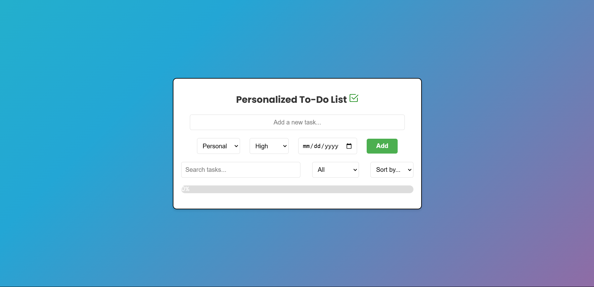

# To-Do List Application

## Overview
This is a simple yet powerful To-Do List application built using **HTML, CSS, and JavaScript**. It allows users to manage their tasks efficiently by adding, editing, deleting, and marking tasks as completed. The app also supports filtering, sorting, and progress tracking.

## Features
- **Add Tasks**: Enter tasks and categorize them into Personal, Work, Shopping, or Other.
- **Priority Selection**: Assign High, Medium, or Low priority to tasks.
- **Due Dates**: Set due dates for tasks.
- **Edit & Delete**: Modify or remove tasks as needed.
- **Task Completion**: Mark tasks as completed with a checkbox.
- **Search & Filter**: Find tasks easily using the search bar or filter by completion status.
- **Sort Tasks**: Sort tasks by due date, priority, or category.
- **Progress Bar**: Visual representation of task completion.
- **Local Storage**: Tasks are saved and persist even after refreshing the page.

## Technologies Used
- **HTML**: Structuring the webpage.
- **CSS**: Styling and responsive UI.
- **JavaScript**: Handling interactions and functionality.
- **Local Storage**: Saving tasks for future use.

## Installation & Usage
1. Clone the repository:
   ```sh
   git clone https://github.com/your-username/todo-list.git
   ```
2. Navigate to the project folder:
   ```sh
   cd todo-list
   ```
3. Open `index.html` in a browser.

## Screenshots


## Future Improvements
- Add drag-and-drop task reordering.
- Implement task reminders.
- Improve UI animations.

## Contributing
Pull requests are welcome. For major changes, please open an issue first to discuss what you would like to change.

## License
This project is open-source and available under the [MIT License](LICENSE).

